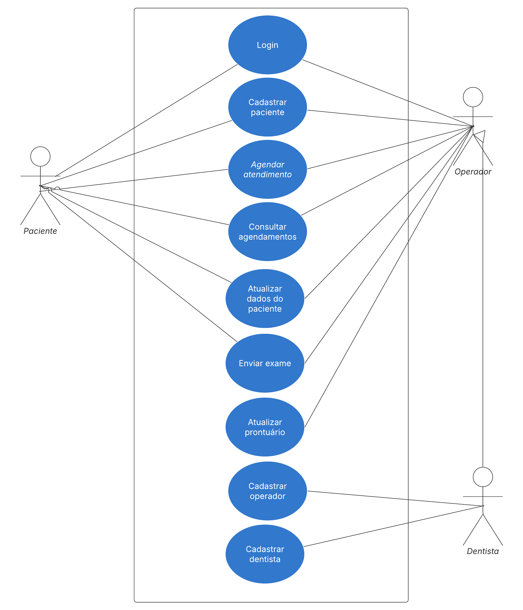

# Especificações do Projeto

Pré-requisitos: <a href="1-Documentação de Contexto.md"> Documentação de Contexto</a>

Definição do problema e ideia de solução a partir da perspectiva do usuário. É composta pela definição do  diagrama de personas, histórias de usuários, requisitos funcionais e não funcionais além das restrições do projeto.

Apresente uma visão geral do que será abordado nesta parte do documento, enumerando as técnicas e/ou ferramentas utilizadas para realizar a especificações do projeto

## Personas

Para garantir que nosso projeto atenda de forma satisfatória às necessidades reais dos usuários, desenvolvemos um conjunto de personas. Essas personas foram criadas com base em dados e pesquisas para refletir uma variedade de perfis e situações que nossos usuários podem enfrentar.

Com base nelas, identificamos possíveis cenários e desafios que nossos usuários reais podem encontrar. Esse processo de criação e análise nos ajudou a visualizar melhor as suas necessidades e expectativas, permitindo que orientássemos o projeto de maneira mais precisa e centrada no usuário.

As personas não apenas serviram como guia para entender os comportamentos e preferências dos nossos usuários, mas também foram fundamentais para direcionar as decisões de design e desenvolvimento. Ao alinhar nosso trabalho com as situações e desafios que essas personas enfrentam, conseguimos garantir que nosso projeto seja mais relevante, útil e eficaz para o público que pretendemos atingir.

>Pacientes

>Operador

>Dentista/Auxiliar de Dentista

## Histórias de Usuários

Com base na análise das personas forma identificadas as seguintes histórias de usuários:

|EU COMO... | QUERO/PRECISO ...  |PARA ...                |
|--------------------|------------------------------------|----------------------------------------|
|Marcos| Marcar ou cancelar horários para consultas pelo site           | Buscando organizar a rotina               |
|Lucas| Ter um FAQ ou canal de dúvidas                 | Que eu possa sanar todas as minhas dúvidas rapidamente |
|Lucas| Fazer um agendamento para avaliação pelo site           | Evitar filas de espera ao telefone ou conversas em chats               |
|Rafaela| Realizar cadastro de pacientes                 | Acessar seus cadastros de qualquer computador com acesso à internet |
|Rafaela| Quadro de horários atualizado           | Identificar possíveis realocações de horários               |
|Rafaela| Informativo de valores de procedimentos                 | Tirar dúvidas de pacientes |
|Rafaela| Automatização de envio de lembretes para equipe/pacientes | Evitar a falha em atendimentos por falta de material ou exames  |
|Daniela  | Prontuário digital interativo                 | Adicionar informações sobre o paciente |
|Daniela  | Solicitar e receber resultados de exames | Garantir que o paciente receberá orientações para fazer os exames e por vezes prever próximas etapas do tratamento               |
|Daniela    | Organização cronológica dos procedimentos do paciente                 | Observar evolução do tratamento  |
|Leandro | Avaliar histórico do paciente           | Identificar o que pode ser feito para prepará-lo para a consulta               |
|Leandro | Preencher etapas realizadas                | Criar um histórico de cada atendimento |

## Requisitos

As tabelas que se seguem apresentam os requisitos funcionais e não funcionais que detalham o escopo do projeto.

### Requisitos Funcionais

|ID    | Descrição do Requisito  | Prioridade |
|------|-----------------------------------------|----|
|RF-001| O sistema deve permitir o cadastro de pacientes, dentistas e operadores. |ALTA|
|RF-002| O sistema deve permitir login para pacientes, dentistas e operadores. |ALTA|
|RF-003| O paciente deve poder agendar e cancelar consultas pelo sistema. |ALTA|
|RF-004| O operador deve poder agendar consultas para pacientes. |ALTA|
|RF-005| O dentista deve visualizar e gerenciar sua agenda de consultas. |ALTA|
|RF-006| O sistema deve permitir que dentistas adicionem, editem e removam informações do prontuário dos pacientes. |ALTA|
|RF-007| O dentista deve poder adicionar anotações sobre o tratamento do paciente a cada consulta. |ALTA|
|RF-009| O dentista deve poder anexar resultados e prescrições ao prontuário do paciente. |ALTA|
|RF-010| O paciente deve poder enviar e visualizar exames dentro do sistema. |ALTA|
|RF-011| O paciente deve poder visualizar seu histórico de exames e consultas. |MÉDIA|
|RF-012| O sistema deve organizar de forma cronológica todos os atendimentos, exames e procedimentos do paciente. |MÉDIA|

### Requisitos não Funcionais

|ID     | Descrição do Requisito  |Prioridade |
|-------|-------------------------|----|
|RNF-001| A interface do sistema deve ser intuitiva e responsiva para dispositivos móveis e desktops.| ALTA|
|RNF-002| O sistema deve implementar autenticação segura,| ALTA|
|RNF-003| O sistema deve ser capaz de suportar múltiplos acessos.| ALTA|
|RNF-004| O sistema deve ser compatível com navegadores modernos (Chrome, Firefox, Edge e Safari).| ALTA|

## Restrições

O projeto está restrito pelos itens apresentados na tabela a seguir.

|ID| Restrição                                             |
|--|-------------------------------------------------------|
|01| O sistema será desenvolvido como uma aplicação web.|
|02| Pacientes só podem visualizar seus próprios dados.|
|03| O sistema deve ser hospedado em um servidor seguro e confiável.|

## Diagrama de Casos de Uso

